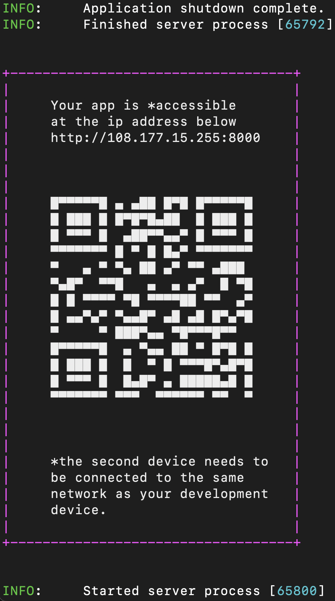

## Demo link for fasthtml apps
This repo contains a simple fasthtml app
that encodes the app url in a QR code and prints it to the console when starting the server.
This makes it really easy for developers to live test any user facing changes on another device such as a mobile or tablet before committing them.

## 1st time setup

```commandline
git clone git@github.com:comhar/fasthtml-qrcode.git
cd fasthtml-qrcode
virtualenv env -p python3
source env/bin/activate
pip install -r requirements.txt
```

## Run the app
```
python main.py
```

A QR code like the one below should be printed to the console.



To access your app simply scan the code using your phone or tablet.

⚠️ Gotchas
- the second device (i.e. phone) must be connected to the same network as your development device (i.e. laptop)
- the app url is served over http so the browser on your second device will scream that it is unprotected
- you'll need to switch off protections when you first load the page on your second device